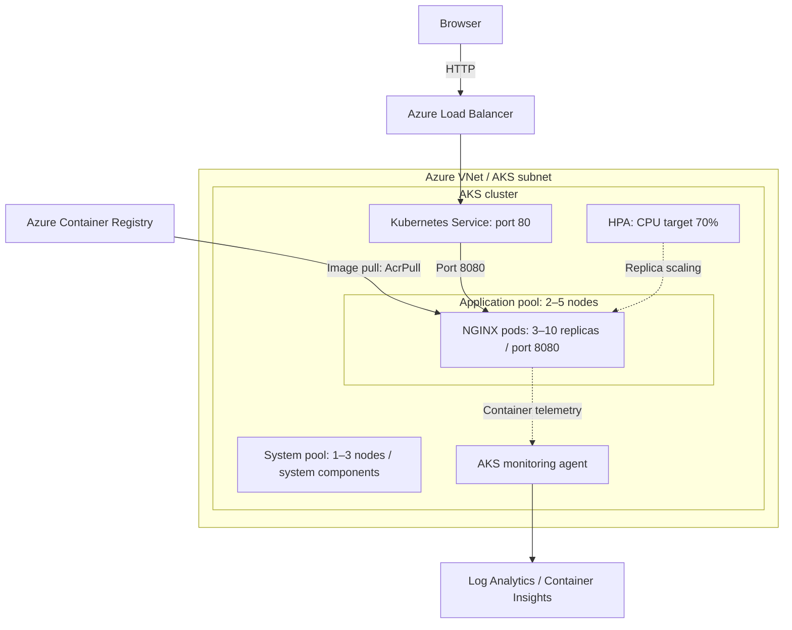
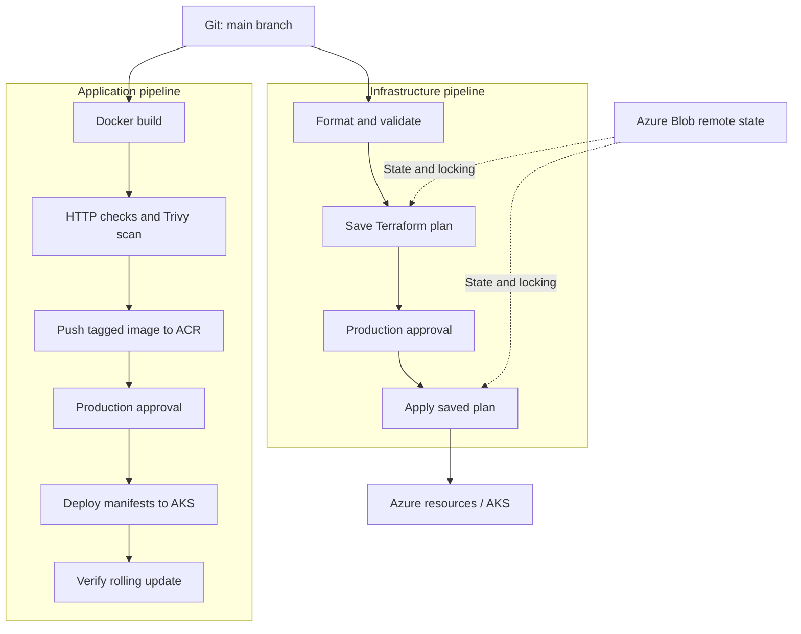

# Azure AKS Web Application Deployment with Terraform and Azure Pipelines

## Project overview

Deploy a containerized NGINX web application on Azure Kubernetes Service (AKS). Terraform provisions the infrastructure, Azure Container Registry (ACR) stores images, and Azure Pipelines automates infrastructure changes and application releases.

## Technical stack

| Layer | Technology | Project configuration / purpose |
|---|---|---|
| Cloud | Microsoft Azure | Hosts networking, registry, AKS, state storage, and logs |
| Infrastructure | Terraform | CLI `>= 1.11, < 2.0`; pipelines install `1.15.6` |
| Azure provider | `hashicorp/azurerm` | Constraint `~> 4.59`; lock file selects `4.81.0` |
| Application | HTML and NGINX | Static page at `/`; health endpoint at `/health` |
| Containers | Docker | Base image `nginx:stable-alpine`; deployments build for Linux AMD64 |
| Registry | Azure Container Registry | Premium SKU; admin account disabled; tagged images |
| Orchestration | Azure Kubernetes Service | Standard tier; separate system and application pools |
| Networking | Azure VNet and Azure CNI Overlay | Dedicated AKS subnet and separate pod/service ranges |
| Traffic | Standard Azure Load Balancer | Public HTTP port 80 routed to container port 8080 |
| Scaling | Kubernetes HPA and AKS cluster autoscaler | CPU-based pod scaling and node capacity scaling |
| Identity | Microsoft Entra ID and Azure RBAC | Managed identities, kubelogin, and pipeline workload identity federation |
| CI/CD | Azure Pipelines | YAML pipelines on `ubuntu-latest`; production environment approvals |
| Image scanning | Trivy | `aquasec/trivy:latest`; blocks fixable HIGH/CRITICAL findings |
| State | Azure Blob Storage | Entra authentication, blob versioning, and seven-day delete retention |
| Monitoring | Log Analytics and Container Insights | AKS monitoring agent; 30-day log retention |
| Source control | Git | Relevant changes on `main` trigger pipelines |

## Objectives

- Provision repeatable Azure infrastructure using Terraform.
- Automate container builds, checks, scanning, and deployment.
- Scale application pods and AKS nodes independently.
- Use identity-based access and approved production deployments.
- Support health monitoring and rolling application updates.

## Implementation plan

| Phase | Work | Result |
|---|---|---|
| 1. Prepare | Configure Azure access, inputs, and remote state | Deployment prerequisites ready |
| 2. Provision | Apply Terraform for networking, ACR, AKS, identities, and logs | Platform ready for workloads |
| 3. Deploy | Build and push the image; apply Kubernetes resources | Application reachable over HTTP |
| 4. Automate and verify | Configure pipelines/approvals; check rollout, scaling, and logs | Repeatable delivery and operations |

## Architecture

| Area | Flow |
|---|---|
| Infrastructure CI/CD | Git → validate → saved Terraform plan → approval → apply → Azure |
| Application CI/CD | Git → Docker build → HTTP checks → Trivy scan → ACR → approval → AKS rollout |
| Application traffic | Browser → Azure Load Balancer → Service port 80 → NGINX pods on port 8080 |
| Monitoring | AKS monitoring agent → Log Analytics → Container Insights |

AKS uses Azure CNI Overlay within a VNet. System components use the system pool; application pods select the dedicated application pool. The kubelet pulls images using AcrPull. Remote state is stored in a separately bootstrapped Azure Storage account.

### Runtime architecture



### CI/CD architecture



Run infrastructure provisioning before the first application deployment. The pipelines are separate; approval checks are configured on the Azure DevOps `production` environment.

## Repository structure

| Directory | Contents |
|---|---|
| [app/](app/) | HTML page, NGINX configuration, Dockerfile |
| [terraform/](terraform/) | Infrastructure, variables, outputs, backend examples, provider lock file |
| [kubernetes/](kubernetes/) | Namespace, Deployment, LoadBalancer Service, HPA |
| [pipelines/](pipelines/) | Infrastructure/application pipelines and shared Terraform template |
| [scripts/](scripts/) | State bootstrap, manual application deployment, CI Terraform execution |

## Key settings

| Setting | Default |
|---|---|
| Region / resource group | `centralindia` / `rg-aks-production` |
| AKS / ACR | `aks-production`, Standard tier / Premium registry |
| Networking | VNet `10.0.0.0/16`; subnet `10.0.1.0/24`; pods `10.244.0.0/16`; services `10.10.0.0/16` |
| Node pools | System: 1–3 nodes; application: 2–5 nodes; both use `Standard_D2s_v5` |
| Application scaling | Initially 3 replicas; HPA: 3–10 replicas at 70% requested CPU utilization |
| Pod resources | CPU: `100m` request / `500m` limit; memory: `128Mi` request / `256Mi` limit |
| Updates / health | RollingUpdate: 0 unavailable, 1 surge; `/health` readiness and liveness probes |
| Logs | Log Analytics with 30-day retention |
| Terraform | CLI `>= 1.11, < 2.0`; pipelines use `1.15.6`; AzureRM lock file selects `4.81.0` |

## Prerequisites and configuration

Install 
- Azure CLI
- Terraform
- Docker
- kubectl
- kubelogin
- Git
- Bash
- curl.

```
# Azure CLI
az version

# Terraform
terraform version

# Docker
docker --version

# Docker Compose
docker compose version

# kubectl
kubectl version --client

# kubelogin
kubelogin --version

# Git
git --version

# Bash
bash --version

# curl
curl --version
```

## Requirements
1. Start Docker. Your Azure subscription needs regional VM capacity and provisioning access.
2. Provisioning identities need Contributor and Role Based Access Control Administrator at the deployment scope.
3. State users need Storage Blob Data Contributor.
4. Image publishers need AcrPush or equivalent access.

## Guidelines 
1. Copy [terraform/terraform.tfvars.example](terraform/terraform.tfvars.example) to `terraform/terraform.tfvars`.
2. Set the subscription, region, resource names, globally unique ACR name, and `admin_principal_ids`.
3. Use Entra **object IDs**, including your operator and application pipeline identity.
4. Terraform grants those principals AKS access.
5. Change `node_vm_size` if needed.

## Steps to run

### Local application

1. Build with `docker buildx build --platform linux/amd64,linux/arm64 -t aks-webapp:v1 ./app`.
2. Start with `docker run -d --name aks-webapp --read-only --tmpfs /tmp:uid=101,gid=101 -p 8080:8080 aks-webapp:v1`.
3. Open `http://localhost:8080`; verify `curl --fail http://localhost:8080/health`.

### Health endpoint

NGINX serves `GET /health` on container port 8080 with HTTP `200`, content type `text/plain`, and body `healthy`. Responses use `Cache-Control: no-store`. The UI health check, Docker health check, and Kubernetes probes use this endpoint.

After building and starting the container above, inspect the response with `curl -i http://localhost:8080/health`. Rebuild the image and recreate the container after changing NGINX configuration.

### Azure deployment

1. Run `az login` and `az account set --subscription "<SUBSCRIPTION-ID>"`. Complete the input configuration above.
2. Run `TFSTATE_STORAGE_ACCOUNT=<unique-lowercase-name> bash scripts/bootstrap-state.sh`. It generates `terraform/backend.hcl`; for existing state storage, copy and edit [terraform/backend.hcl.example](terraform/backend.hcl.example) instead. Grant state access to the pipeline identity separately.
3. Run `terraform -chdir=terraform fmt -check -recursive`, then `terraform -chdir=terraform init -backend-config=backend.hcl` and `terraform -chdir=terraform validate`.
4. Run `terraform -chdir=terraform plan -out=tfplan`, review the plan, then run `terraform -chdir=terraform apply tfplan`.
Example:
```
az ad signed-in-user show \
  --query id \
  -o tsv

["569e301d-629a-4d19-a477-a250605ef6ba"]

08b7b8d4-af42-4972-9517-11ea256ea068
```
### Terraform Outputs:
```
acr_login_server = "atulkamble.azurecr.io"
acr_name = "atulkamble"
aks_id = "/subscriptions/08b7b8d4-af42-4972-9517-11ea256ea068/resourceGroups/rg-aks-production/providers/Microsoft.ContainerService/managedClusters/aks-production"
aks_name = "aks-production"
aks_oidc_issuer_url = "https://centralindia.oic.prod-aks.azure.com/bc281606-c655-4c05-90f2-49309a59c59f/2f5a3401-d58f-44f5-acc0-70de9999d46e/"
log_analytics_workspace_id = "/subscriptions/08b7b8d4-af42-4972-9517-11ea256ea068/resourceGroups/rg-aks-production/providers/Microsoft.OperationalInsights/workspaces/aks-production-logs"
resource_group_name = "rg-aks-production"
```
6. Ensure your publishing identity can push to ACR. Allow role assignments to propagate, then run `bash scripts/deploy-app.sh v1` from the repository root. It builds a Linux AMD64 image, pushes it, replaces the manifest image placeholder, and deploys to AKS.
```
which kubectl

kubectl version --client

brew install Azure/kubelogin/kubelogin

which kubelogin

kubelogin --version

sudo az aks install-cli

az aks get-credentials \
  --resource-group rg-aks-production \
  --name aks-production \
  --overwrite-existing

kubelogin convert-kubeconfig -l azurecli

kubectl get nodes

az acr repository list \
  --name atulkamble \
  --output table

az acr repository show-tags \
  --name atulkamble \
  --repository webapp \
  --output table

kubectl apply -f kubernetes/deployment.yaml

kubectl rollout status deployment/webapp \
  -n production

kubectl apply -f kubernetes/hpa.yaml

kubectl get pods \
  -n production \
  -o wide

kubectl get hpa \
  -n production

kubectl get svc webapp-service \
  -n production

kubectl get all \
  -n production

kubectl get svc webapp-service \
  -n production \
  -o jsonpath='{.status.loadBalancer.ingress[0].ip}'
```
8. Run `kubectl get pods,svc,hpa -n production`. Wait for the external IP of `webapp-service`, then open `http://<EXTERNAL-IP>`.

Keep the Terraform lock file committed. Local settings, state, and plans are ignored by Git.

## Azure Pipelines setup

1. Create a workload identity federation service connection named `azure-production-connection`. Assign provisioning, state, image-publishing, and AKS access as described above.
2. Install the Microsoft DevLabs Terraform extension. Create and authorize the `aks-production` variable group.
3. Set `location`, `resourceGroup`, `aksCluster`, `acrName`, `adminPrincipalIds` (JSON array of object IDs), `tfstateResourceGroup`, `tfstateStorageAccount`, `tfstateContainer`, and `tfstateKey`. Match local settings; defaults for the container/key are `tfstate` / `production.aks.tfstate`. Add `vnetName` and `nodeVmSize` if customized.
4. Create the `production` environment, authorize both pipelines, and configure approvers plus an exclusive lock check. Approvals are enforced through Azure DevOps environment settings.
5. Create pipelines from [infrastructure.yml](pipelines/infrastructure.yml) and [application.yml](pipelines/application.yml). Run infrastructure first, review its plan artifact, and approve apply. Then run and approve the application pipeline.

Relevant file changes on `main` trigger each pipeline. Deployment stages exclude pull request runs. Application images use the build ID as their tag; the scan blocks fixable HIGH/CRITICAL vulnerabilities. The pipelines are not automatically chained.

## Operations and security

- **Release:** Push application changes to `main`, or run `bash scripts/deploy-app.sh v2` with a new tag.
- **Verify:** `kubectl rollout status deployment/webapp -n production --timeout=300s`.
- **Monitor:** `kubectl logs -n production deployment/webapp`, `kubectl get hpa -n production`, and the AKS Insights view.
- **Rollback:** `kubectl rollout undo deployment/webapp -n production`; align the next release with the intended version.
- **Cleanup:** Review `terraform -chdir=terraform plan -destroy -out=destroy.tfplan`, then apply with `terraform -chdir=terraform apply destroy.tfplan`. State storage is retained separately. Remove the local container with `docker rm -f aks-webapp`.

AKS local accounts and the ACR admin account are disabled. Containers run as non-root with a read-only filesystem and restricted pod security. Pipeline authentication uses federation; the state account disables shared-key access and enables blob versioning.

## Scope

The current endpoint uses public HTTP. TLS, ingress, private endpoints, Key Vault integration, availability zones, Pod Disruption Budgets, and custom alerts are future enhancements. AKS workload identity is enabled, but application identity bindings are not configured. The one-node system-pool minimum does not provide node redundancy for system components.

## Conclusion

The project provides a repeatable workflow from Terraform provisioning to container delivery on AKS, with autoscaling, identity-based access, approved releases, health checks, and centralized logging.

**License:** [MIT](LICENSE) · **Author:** Atul Kamble
